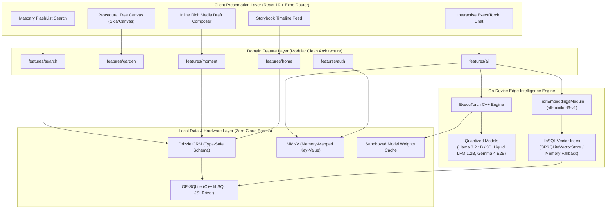

# Nimo — Private On-Device AI Life Journal & Mindful Memory Garden

<p align="center">
  
</p>

<p align="center">
  <strong>An offline-first, edge-AI personal life journal powered by on-device LLMs, local semantic vector search (RAG), and procedural generative memory visualization.</strong>
</p>

<p align="center">
  <a href="https://expo.dev"></a>
  <a href="https://reactnative.dev"></a>
  <a href="https://react.dev"></a>
  <a href="https://pytorch.org/executorch"></a>
  <a href="https://github.com/op-engineering/op-sqlite"></a>
  <a href="https://orm.drizzle.team"></a>
  <a href="https://github.com/mrousavy/react-native-nitro-modules"></a>
  <a href="https://nativewind.dev"></a>
  <a href="./LICENSE"></a>
</p>

---

## ⚡ System Architecture & Core Engineering Highlights

> [!IMPORTANT]
> **Core Architectural Premise**: Conventional AI journaling products stream intimate, vulnerable thoughts to remote cloud inference endpoints (OpenAI, Anthropic). **Nimo eliminates the cloud entirely for inference and data persistence.** Everything—token generation, dense vector embedding calculation, cosine similarity indexing, and relational storage—executes **100% locally on the user's physical device silicon** via C++ JSI bindings.

### Technical Highlights at a Glance

| Pillar | Engineering Implementation | Key Metric / Capability |
| :--- | :--- | :--- |
| **Edge AI Inference** | PyTorch **ExecuTorch** runtime via C++ native JSI bindings | 4 quantized models (1B to 3B params) running offline on mobile NPU/CPU |
| **On-Device RAG** | `all-minilm-l6-v2` embeddings + `@react-native-rag/op-sqlite` | Local dense vector search with top-K bounded retrieval to prevent mobile RAM spikes |
| **High-Throughput DB** | `@op-engineering/op-sqlite` (libSQL) + **Drizzle ORM** | Sub-millisecond synchronous SQLite queries bypassing the old React Native bridge |
| **Synchronous State** | `react-native-mmkv` + Zustand external store | 30x faster read/write latency than `AsyncStorage` via direct memory-mapped files |
| **Procedural Graphics** | Canvas-based generative recursion with dynamic vectors | 60 FPS generative branching tree mapping reflections to emotional leaf hues |
| **Virtualization** | `@shopify/flash-list` 2.0 with custom 2-column masonry | 60/120 FPS recycling list performance over unbounded journal collections |
| **Modern Toolchain** | Expo SDK 56 + React 19 + **React Compiler** + Typed Routes | Zero manual memoization boilerplate (`useMemo`/`useCallback` automated by compiler) |

---

## 🏛️ System Architecture



---

## 🔬 Deep-Dive: Core Technical Challenges & Solutions

### 1. Memory-Constrained Edge LLM Inference (PyTorch ExecuTorch)
* **The Challenge**: Running 1B to 3B parameter models on mobile devices with strict RAM ceilings (often 4GB to 6GB total on Android, shared with the OS). An unoptimized model execution causes instant Android Low Memory Killer (LMK) terminations or iOS memory watchdog crashes.
* **The Solution**:
  - Implemented the official PyTorch **ExecuTorch** runtime (`react-native-executorch`), leveraging native C++ execution directly against mobile silicon (Apple Neural Engine / Qualcomm Hexagon / CPU).
  - Designed an adaptive multi-model tiering engine ([`useModelStore`](file:///c:/Users/ASUS/OneDrive/Documents/Ashok%20Kumar/startups/Nimo/src/features/ai/hooks/useModelStore.ts#L33-L110)) with hard hardware constraints:
    - **Llama 3.2 1B Instruct** (~750 MB): Default companion optimized for 4 GB RAM devices; capped at ~1.0–1.2 GB peak RAM during generation.
    - **Liquid LFM 2.5 1.2B Instruct** (~780 MB): Employs non-Transformer hybrid recurrence for ultra-low latency token prefill across long contexts.
    - **Gemma 4 E2B** (~1.4 GB): Google reasoning engine for structured cognitive reframing.
    - **Llama 3.2 3B Instruct** (~1.8 GB): Gated exclusively for 6 GB–8 GB+ flagship hardware for multi-week introspection synthesis.
  - Implemented proactive background scanning and sandboxed resource management (`ExpoResourceFetcher`) allowing users to install, inspect, and delete individual weight binaries to balance disk constraints.

### 2. Private On-Device RAG with Dense Vector Embeddings
* **The Challenge**: Injecting historical journal entries into an LLM context without exceeding the context window, triggering latency spikes, or sending entries to third-party embedding APIs.
* **The Solution**:
  - **Local Embeddings**: Built a native adapter [`ExecuTorchEmbeddings`](file:///c:/Users/ASUS/OneDrive/Documents/Ashok%20Kumar/startups/Nimo/src/lib/ragService.ts#L10-L43) wrapping ExecuTorch's `TextEmbeddingsModule` with `all-minilm-l6-v2`. Vectorization occurs completely on-device in milliseconds.
  - **libSQL Vector Storage**: Linked with [`@react-native-rag/op-sqlite`](file:///c:/Users/ASUS/OneDrive/Documents/Ashok%20Kumar/startups/Nimo/src/lib/ragService.ts#L69-L76) to utilize SQLite's native vector extension (`libsql_vector_idx`).
  - **Graceful Fallback**: Integrated an automatic in-memory vector index (`MemoryVectorStore`) in case host device binaries lack native vector extensions.
  - **Bounded Context Injection**: Semantic search evaluates cosine distance and retrieves *only* the top $K$ ($K=2$ to $4$) most relevant moments ([`queryRelevantMoments`](file:///c:/Users/ASUS/OneDrive/Documents/Ashok%20Kumar/startups/Nimo/src/lib/ragService.ts#L141-L162)). This keeps memory footprints bounded and eliminates LLM hallucination over irrelevant history.

### 3. Procedural Generative Canvas (The Memory Garden)
* **The Challenge**: Visualizing hundreds of user entries not as static charts, but as an interactive, living reflection tree that grows with journaling frequency without lagging the main UI thread.
* **The Solution**:
  - Engineered a procedural recursive branching tree algorithm on React Native canvas.
  - **Mathematical Formulation**: Branch splits calculate organic variance using deterministic trigonometry:
    $$\theta_{branch} = \theta_{parent} \pm \Delta\theta \times (1 + \text{jitter})$$
  - Each recorded reflection manifests as an individual colored leaf placed at terminal branch nodes.
  - The leaf's HSL/RGB palette is dynamically computed from the entry's detected emotional sentiment (Joy: warm terracotta `#E58C74`, Calm: botanical sage `#8CA898`, Focus: charcoal, Inspired: vibrant amber).
  - Tree growth progresses through 5 biological stages: *Seedling $\rightarrow$ Sprout $\rightarrow$ Sapling $\rightarrow$ Mature Canopy $\rightarrow$ Ancient Guardian*.

### 4. High-Throughput Local Relational Architecture (OP-SQLite + Drizzle)
* **The Challenge**: Standard React Native SQLite wrappers communicate over asynchronous JSON serialization bridges, causing noticeable UI stutter during bulk read/write operations (e.g., full-text search across thousands of reflections).
* **The Solution**:
  - Switched to [`@op-engineering/op-sqlite`](file:///c:/Users/ASUS/OneDrive/Documents/Ashok%20Kumar/startups/Nimo/package.json#L9), a modern JSI-based C++ SQLite engine compiled with libSQL and fast vector support. Queries execute synchronously with zero bridge crossing overhead.
  - Layered [**Drizzle ORM**](file:///c:/Users/ASUS/OneDrive/Documents/Ashok%20Kumar/startups/Nimo/src/db/schema.ts#L1-L61) over OP-SQLite for compile-time type safety, relational mappings (`journal` $\leftrightarrow$ `moment` $\leftrightarrow$ `dailyTask`), and automated SQL migration generation.
  - Backed transient settings, theme tokens, and model activation states with `react-native-mmkv` for sub-millisecond memory-mapped reads.

---

## ⚖️ Architectural Decisions & Trade-Offs (ADR Summary)

| Decision | Alternative Considered | Trade-Off & Engineering Justification |
| :--- | :--- | :--- |
| **PyTorch ExecuTorch (Local LLM)** | OpenAI / Anthropic Cloud APIs | **Trade-Off**: Higher initial APK download size & hardware RAM constraints.<br/>**Why**: Guarantees zero data egress, 100% privacy, zero cloud hosting costs, and true offline capability in remote environments. |
| **OP-SQLite (C++ JSI) + Drizzle** | WatermelonDB / AsyncStorage | **Trade-Off**: Requires native compilation (prebuild).<br/>**Why**: Standard SQLite wrappers are bottlenecked by bridge serialization. OP-SQLite provides direct C++ pointers and libSQL vector indexing, while Drizzle provides zero-runtime-overhead TypeScript types. |
| **MMKV over AsyncStorage** | `AsyncStorage` / SQLite for KV | **Trade-Off**: Synchronous storage requires disciplined payload size management.<br/>**Why**: MMKV memory-maps keys to virtual memory, providing 30x faster reads without asynchronous React suspension. |
| **Shopify FlashList over FlatList** | React Native `FlatList` | **Trade-Off**: Strict item height estimation requirements.<br/>**Why**: Recycles native views rather than continually creating/destroying them, maintaining 60/120 FPS on 2-column masonry layouts with complex cards. |
| **Domain-Driven Modular Feature Folders** | Layer-first folders (`/screens`, `/services`) | **Trade-Off**: Deeper initial folder nesting.<br/>**Why**: Colocates UI, business logic, state hooks, and documentation for each feature (`features/ai`, `features/garden`), preventing tight coupling and enabling parallel feature development. |

---

## 📂 Modular Feature Architecture (Domain-Driven Design)

The codebase follows a strict **Domain-Driven Modular Architecture** under `src/features/`. Each domain is an isolated vertical slice containing its own presentation, coordination, business, and documentation layers:

```
src/features/ai/
├── components/          # Pure presentational and container components
│   ├── AIScreenView.tsx # Top-level AI tab view
│   └── NimoAIChat.tsx   # Conversational UI with streaming tokens & memory context
├── services/            # Pure TypeScript business services (zero React lifecycle hooks)
│   └── aiService.ts     # Model catalog queries & configuration helpers
├── hooks/               # React hooks managing local state, haptics, and store binding
│   └── useModelStore.ts # Synchronous MMKV-backed model catalog & disk manager
├── utils/               # Storage keys, default system prompts, and configuration
│   └── aiConstants.ts   # System prompts and default hyperparameter mappings
├── docs/                # Comprehensive technical documentation for this feature
│   ├── OVERVIEW.md      # Mermaid diagrams and feature file interconnections
│   ├── COMPONENTS.md    # Component contracts, props interfaces, and render states
│   ├── SERVICES.md      # Service methods, return types, and side-effects
│   ├── HOOKS.md         # State transition tables and hook lifecycles
│   ├── UTILS.md         # Configuration schemas and constants
│   └── FLOWS.md         # Interaction sequence diagrams
└── index.ts             # Public boundary barrel export (shields internal feature details)
```

> 📖 **Feature Documentation**: Every feature in the project (`ai`, `auth`, `calendar`, `garden`, `home`, `journal`, `moment`, `onboarding`, `profile`, `search`, `settings`, `timeline`) contains its own dedicated `docs/` folder with complete architectural specifications.

---

## 🤖 Model Specifications & Resource Allocation

| Model Identifier | Parameter Count | Quantization | Disk Footprint | Peak Mobile RAM | Min. Memory Tier | Primary Specialty |
| :--- | :--- | :--- | :--- | :--- | :--- | :--- |
| **`llama3_2_1b`** | 1.23B | 4-bit / Q4_0 | ~750 MB | ~1.1 GB | 4 GB Devices | Low-latency daily journal prompts, empathetic active listening |
| **`lfm2_5_1_2b_instruct`** | 1.2B | Hybrid Non-Transformer | ~780 MB | ~1.1 GB | 4 GB Devices | High-efficiency RAG synthesis, rapid context prefill |
| **`gemma4_e2b`** | 2.0B | 4-bit / Q4_K_M | ~1.4 GB | ~1.6 GB | 4 GB Devices | Structured cognitive reframing, multilingual mindfulness |
| **`llama3_2_3b`** | 3.21B | 4-bit / Q4_K_M | ~1.8 GB | ~2.4 GB | 6 GB–8 GB+ Flagships | Multi-week pattern discovery, deep psychological retrospectives |

---

## 🛠️ Complete Tech Stack

```
Runtime & Native Platform:
  ├── Expo SDK 56 (~56.0.12)
  ├── React Native 0.85.3 (New Architecture ready)
  ├── React 19.2.3 (with React Compiler)
  └── TypeScript 5.9 (Strict mode enabled)

Edge AI & Vector Intelligence:
  ├── react-native-executorch (^0.9.2) - PyTorch ExecuTorch edge inference
  ├── react-native-executorch-expo-resource-fetcher (^0.9.1) - Model weight downloads
  ├── react-native-rag (^0.9.0) - Retrieval-augmented generation framework
  └── @react-native-rag/op-sqlite (^0.9.0) - On-device vector store adapter

Persistence & Caching:
  ├── @op-engineering/op-sqlite (^15.2.14) - Fast C++ libSQL SQLite engine
  ├── drizzle-orm (^0.45.2) & drizzle-kit (^0.31.10) - Type-safe relational schema & migrations
  └── react-native-mmkv (^4.3.1) - High-speed memory-mapped KV storage

UI, Layout & Animations:
  ├── NativeWind (^4.0.1) & Tailwind CSS (^3.3.2) - Utility styling
  ├── @shopify/flash-list (2.0.2) - Virtualized masonry list rendering
  ├── react-native-reanimated (4.3.1) & react-native-worklets - Fluid UI thread animations
  ├── react-native-gesture-handler (~2.31.1) - Native touch interaction
  ├── react-native-enriched-markdown (^1.0.2) - Rich text rendering for entries
  └── lucide-react-native (^1.21.0) - Vector icon system

Media & Native Integrations:
  ├── expo-video (~56.1.4) & expo-image (~56.0.13) - Hardware-accelerated media
  ├── expo-haptics (~56.0.3) - Tactile vibrational feedback
  ├── expo-notifications (~56.0.25) - Local background notifications scheduler
  └── react-native-nitro-google-signin (^1.1.0) - Nitro JSI Google authentication
```

---

## 🚀 Local Development & Build Guide

### Prerequisites
- **Node.js**: `>= 18.x`
- **Package Manager**: `npm`
- **Native Toolchain**:
  - Android: Android Studio Hedgehog+, JDK 17, Android SDK 34, NDK & CMake
  - iOS (macOS required): Xcode 15+, CocoaPods
- **Expo CLI**: Available via `npx expo`

> ⚠️ **Important Build Note**: Because this application compiles custom native C++ libraries for **ExecuTorch**, **OP-SQLite**, and **Nitro Modules**, it cannot execute inside the sandboxed Expo Go client. You must compile a **Development Build** using `expo run:android` or `expo run:ios`.

### Quickstart

1. **Clone the repository**:
   ```bash
   git clone https://github.com/dakstar-org/Nimo.git
   cd Nimo
   ```

2. **Install dependencies**:
   ```bash
   npm install
   ```

3. **Generate SQLite Migrations**:
   ```bash
   npm run db:generate
   ```

4. **Launch Development Build**:
   ```bash
   # Android Native Build
   npm run android

   # iOS Native Build (macOS only)
   npm run ios

   # Web Landing Page & Showcase Preview
   npm run web
   ```

---

## 🧪 Code Quality & Engineering Rigor

- **TypeScript Strict Mode**: Fully typed routes (`typedRoutes: true`), strict null checks, and exhaustive union discriminations across all model configurations.
- **React Compiler Active**: Uses the official React 19 compiler (`reactCompiler: true` in `app.config.ts`), eliminating manual `useMemo` / `useCallback` boilerplate and preventing unnecessary re-renders.
- **Self-Documenting Architecture**: Every single feature contains dedicated documentation covering props, data contracts, and event sequences in `src/features/*/docs/`.
- **Offline Reliability**: Tested against zero-network environments; model inference, full-text search, and reflection storage remain fully operational without internet connectivity.

---

## 📄 License

This project is open source under the [MIT License](./LICENSE).

---

<p align="center">
  Designed & Engineered by <strong>Cornerstone Studio</strong>
</p>
