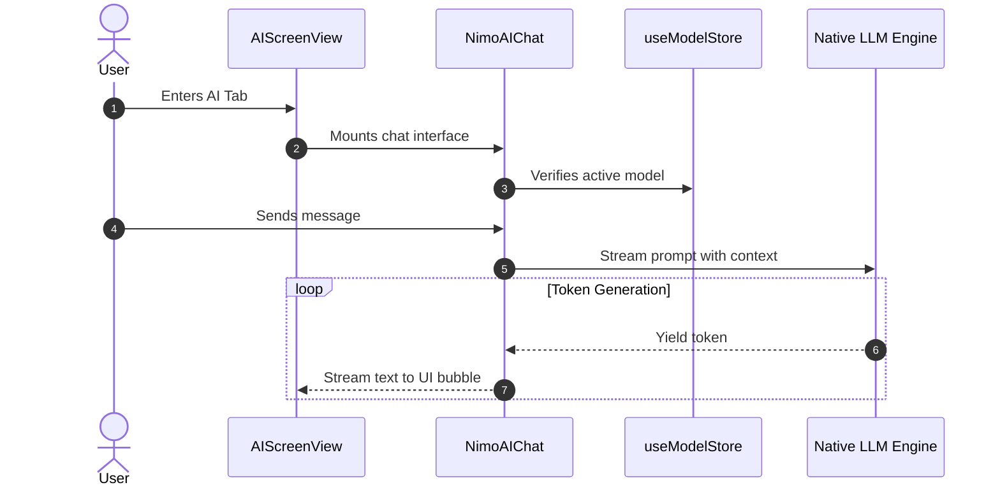

# AI Feature Interaction Flows

Detailed interaction flows for on-device AI chat and model activation.

---

## 1. Chat Message Exchange Flow

```mermaid
sequenceDiagram
    autonumber
    actor User
    participant View as AIScreenView
    participant Chat as NimoAIChat
    participant Store as useModelStore
    participant ExecuTorch as Native LLM Engine

    User->>View: Enters AI Tab
    View->>Chat: Mounts chat interface
    Chat->>Store: Verifies active model
    User->>Chat: Sends message
    Chat->>ExecuTorch: Stream prompt with context
    loop Token Generation
        ExecuTorch-->>Chat: Yield token
        Chat-->>View: Stream text to UI bubble
    end
```
