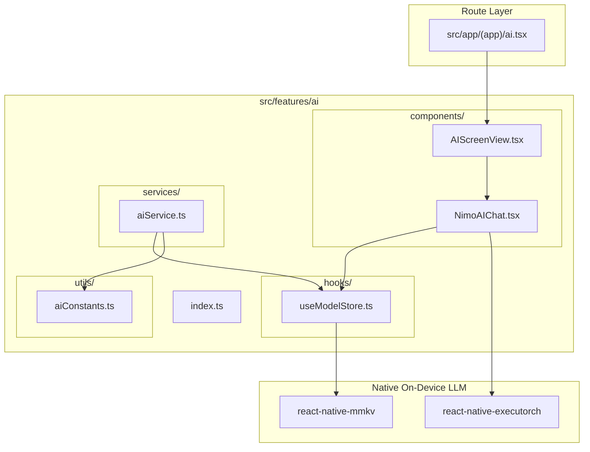

# AI Feature Architecture Overview

The **AI Feature** (`src/features/ai`) provides an on-device local LLM conversational journaling assistant powered by ExecuTorch.

---

## Directory Structure

```
src/features/ai/
├── components/
│   ├── AIScreenView.tsx         # Top-level AI tab container screen
│   └── NimoAIChat.tsx           # Interactive chat interface with memory context
├── services/
│   └── aiService.ts             # On-device model catalogue and configuration helper
├── hooks/
│   └── useModelStore.ts         # Reactive MMKV store for selected model and activation status
├── utils/
│   └── aiConstants.ts           # Storage keys and default system prompts
├── docs/
│   ├── OVERVIEW.md              # Feature architecture & file interconnection (this file)
│   ├── COMPONENTS.md            # UI components, visual states, and prop contracts
│   ├── SERVICES.md              # Service API signatures, return types & side-effects
│   ├── HOOKS.md                 # Hook state transitions, triggers & actions
│   ├── UTILS.md                 # Constants, configuration, and storage keys
│   └── FLOWS.md                 # Interaction sequence diagrams and step-by-step flows
└── index.ts                     # Public API barrel export for external consumers
```

---

## How Files Link Together


