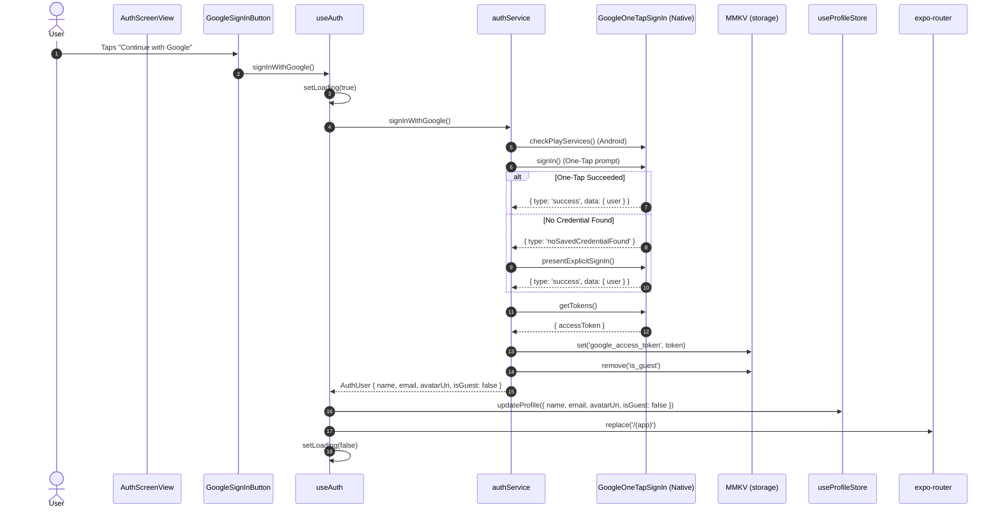
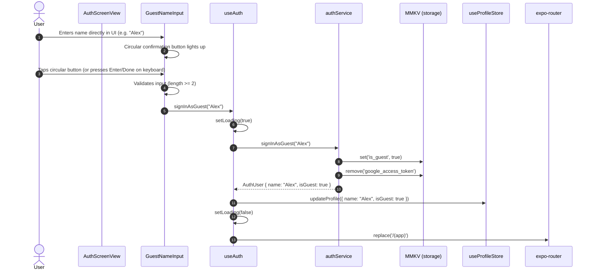
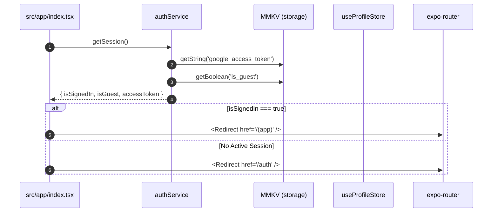
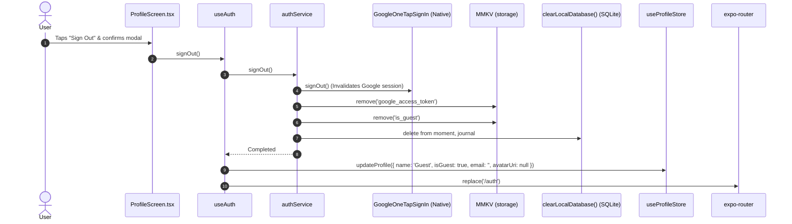

# Auth Feature Interaction Flows

Detailed interaction flows, invocation sequences, and state transitions for all authentication scenarios.

---

## 1. Google Sign-In Flow

### Steps:
1. User taps `<GoogleSignInButton />`.
2. `useAuth` sets `loading = true`.
3. `authService` verifies Google Play Services on Android.
4. `authService` presents the Google One-Tap bottom sheet.
5. If no credential exists on the device, it seamlessly falls back to `presentExplicitSignIn()`.
6. Upon successful selection, OAuth tokens are retrieved from `GoogleOneTapSignIn.getTokens()`.
7. `google_access_token` is saved in MMKV and `is_guest` is removed.
8. `useProfileStore` is updated with Google name, email, and photo URI.
9. Success haptic feedback is triggered and the router transitions to `/(app)`.

---

## 2. Inline Guest User Flow with Circular Confirm Button

### Steps:
1. User sees the guest username input field located directly below Google Sign-In.
2. User types their name into `GuestNameInput`.
3. As soon as characters are entered, the integrated circular confirm button lights up with active `#566434` styling.
4. User taps the circular button or presses the soft keyboard's "Go" action.
5. Name is validated (non-empty, minimum 2 characters).
6. `authService.signInAsGuest()` flags `is_guest = true` and clears any old Google access tokens in MMKV.
7. The profile store receives the guest user's chosen name.
8. Router transitions to `/(app)`.

---

## 3. App Launch Gatekeeper Flow (`src/app/index.tsx`)

---

## 4. User Sign-Out Flow

