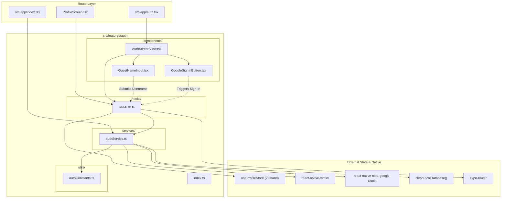

# Auth Feature Architecture Overview

The **Auth Feature** (`src/features/auth`) is responsible for managing identity, authentication lifecycles, OAuth tokens, and guest sessions for the Nimo application.

---

## Directory Structure

```
src/features/auth/
├── components/
│   ├── AuthScreenView.tsx       # Main visual authentication screen view
│   ├── GoogleSignInButton.tsx   # Reusable Google login button with loading feedback
│   └── GuestNameInput.tsx       # Inline input with embedded circular confirm button
├── services/
│   └── authService.ts           # Singleton service wrapping native Google Sign-In & storage
├── hooks/
│   └── useAuth.ts               # React hook coordinating state, haptics, and navigation
├── utils/
│   └── authConstants.ts         # Persistent MMKV keys and OAuth client configuration
├── docs/
│   ├── OVERVIEW.md              # Feature architecture & file interconnection (this file)
│   ├── COMPONENTS.md            # UI components, visual states, and prop contracts
│   ├── SERVICES.md              # Service API signatures, return types & side-effects
│   ├── HOOKS.md                 # Hook state transitions, triggers & actions
│   ├── UTILS.md                 # Constants, configuration, and storage keys
│   └── FLOWS.md                 # Interaction sequence diagrams and step-by-step flows
└── index.ts                     # Public API barrel export for external consumers
```

---

## How Files Link Together



### 1. Presentation Layer (`components/`)
- [AuthScreenView.tsx](file:///c:/Users/ASUS/OneDrive/Documents/Ashok%20Kumar/startups/Nimo/src/features/auth/components/AuthScreenView.tsx) acts as the container. It connects to [useAuth.ts](file:///c:/Users/ASUS/OneDrive/Documents/Ashok%20Kumar/startups/Nimo/src/features/auth/hooks/useAuth.ts) and composes [GoogleSignInButton.tsx](file:///c:/Users/ASUS/OneDrive/Documents/Ashok%20Kumar/startups/Nimo/src/features/auth/components/GoogleSignInButton.tsx) and [GuestNameInput.tsx](file:///c:/Users/ASUS/OneDrive/Documents/Ashok%20Kumar/startups/Nimo/src/features/auth/components/GuestNameInput.tsx).
- Neither `GoogleSignInButton` nor `GuestNameInput` directly call APIs or mutate stores; they emit user intents to `AuthScreenView` / `useAuth`.

### 2. Coordination Layer (`hooks/`)
- [useAuth.ts](file:///c:/Users/ASUS/OneDrive/Documents/Ashok%20Kumar/startups/Nimo/src/features/auth/hooks/useAuth.ts) encapsulates UI state (`loading`, `errorMessage`), executes tactile haptics (`expo-haptics`), syncs identity with `@/features/profile/hooks/useProfileStore`, and controls screen routing with `expo-router`.

### 3. Business & Integration Layer (`services/`)
- [authService.ts](file:///c:/Users/ASUS/OneDrive/Documents/Ashok%20Kumar/startups/Nimo/src/features/auth/services/authService.ts) is a pure TypeScript service independent of React component lifecycles. It directly invokes native modules (`react-native-nitro-google-signin`), reads/writes to MMKV via [authConstants.ts](file:///c:/Users/ASUS/OneDrive/Documents/Ashok%20Kumar/startups/Nimo/src/features/auth/utils/authConstants.ts), and executes database sanitization upon sign-out.

### 4. Public Boundary (`index.ts`)
- The external application only imports from `@/features/auth`. Internal implementation details remain shielded.
