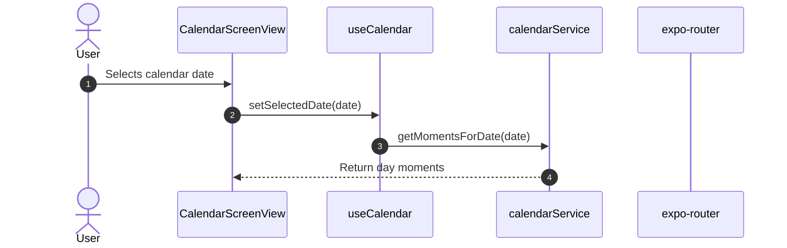

# Calendar Feature Interaction Flows

Detailed interaction flows for date picking and calendar views.

---

## 1. Date Selection Flow

```mermaid
sequenceDiagram
    autonumber
    actor User
    participant View as CalendarScreenView
    participant Hook as useCalendar
    participant Service as calendarService
    participant Router as expo-router

    User->>View: Selects calendar date
    View->>Hook: setSelectedDate(date)
    Hook->>Service: getMomentsForDate(date)
    Service-->>View: Return day moments
```
