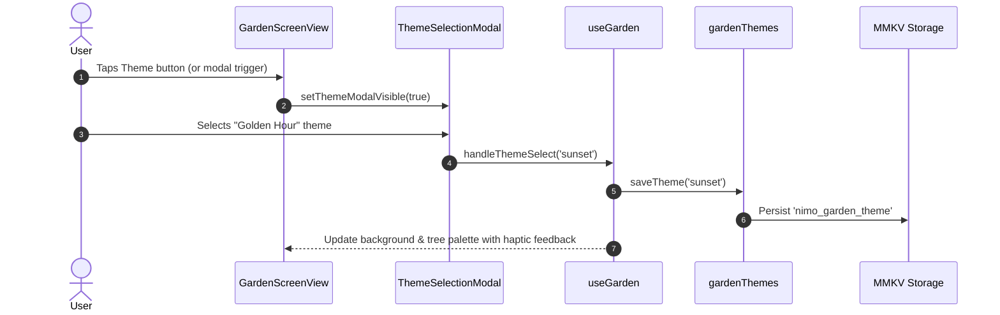

# Garden Feature Interaction Flows

Detailed interaction flows for theme selection and canvas interactions.

---

## 1. Theme Change Flow

```mermaid
sequenceDiagram
    autonumber
    actor User
    participant View as GardenScreenView
    participant Modal as ThemeSelectionModal
    participant Hook as useGarden
    participant Themes as gardenThemes
    participant MMKV as MMKV Storage

    User->>View: Taps Theme button (or modal trigger)
    View->>Modal: setThemeModalVisible(true)
    User->>Modal: Selects "Golden Hour" theme
    Modal->>Hook: handleThemeSelect('sunset')
    Hook->>Themes: saveTheme('sunset')
    Themes->>MMKV: Persist 'nimo_garden_theme'
    Hook-->>View: Update background & tree palette with haptic feedback
```
