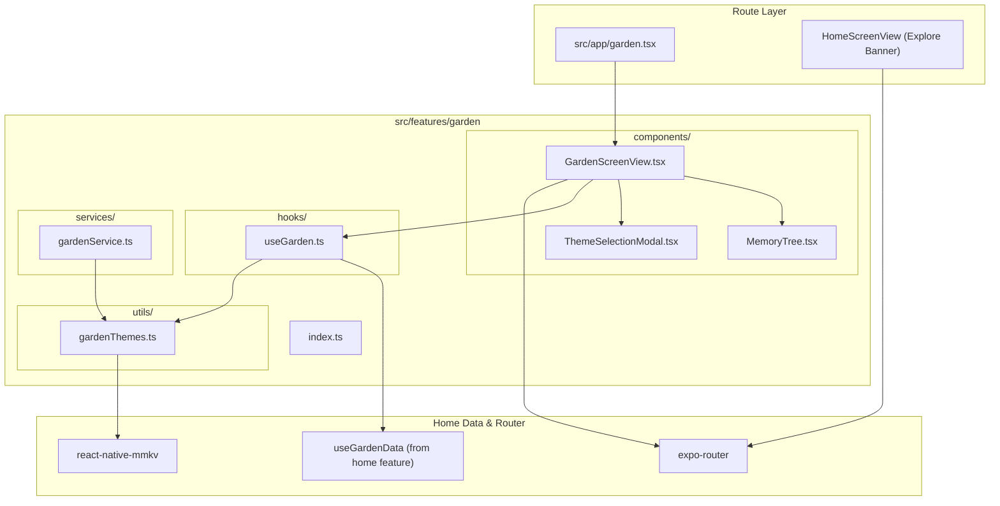

# Garden Feature Architecture Overview

The **Garden Feature** (`src/features/garden`) provides the visual procedural memory tree where every recorded reflection blossoms as a colored leaf on a branching tree canvas.

---

## Directory Structure

```
src/features/garden/
├── components/
│   ├── GardenScreenView.tsx     # Fullscreen memory tree canvas route container
│   ├── ThemeSelectionModal.tsx  # Bottom sheet modal for selecting color themes
│   └── tree/                    # Procedural tree, branch, and leaf renderers
├── services/
│   └── gardenService.ts         # Service querying yearly data and persisting themes
├── hooks/
│   └── useGarden.ts             # Coordinates tree data loading and theme selection
├── utils/
│   └── gardenThemes.ts          # Color schemes, growth stages, plant visual maps, MMKV keys
├── docs/
│   ├── OVERVIEW.md              # Feature architecture & file interconnection (this file)
│   ├── COMPONENTS.md            # UI components, visual states, and prop contracts
│   ├── SERVICES.md              # Service API signatures, return types & side-effects
│   ├── HOOKS.md                 # Hook state transitions, triggers & actions
│   ├── UTILS.md                 # Constants, configuration, and storage keys
│   └── FLOWS.md                 # Interaction sequence diagrams and step-by-step flows
└── index.ts                     # Public API barrel export for external consumers
```

---

## How Files Link Together


