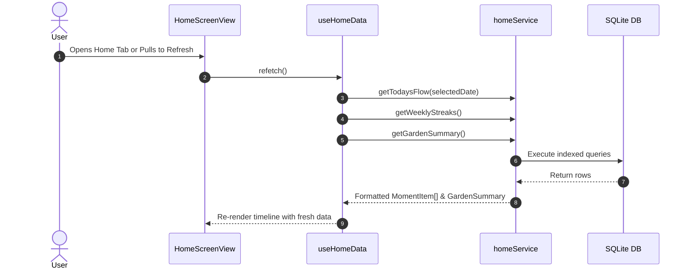
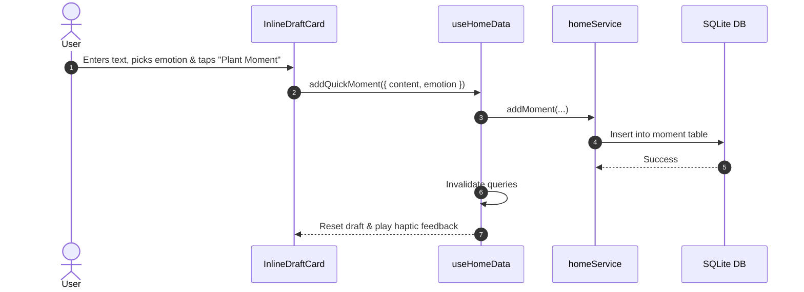

# Home Feature Interaction Flows

Detailed interaction flows for timeline navigation, quick capture, and pull-to-refresh.

---

## 1. Timeline Refresh & Query Flow

---

## 2. Quick Moment Capture Flow

