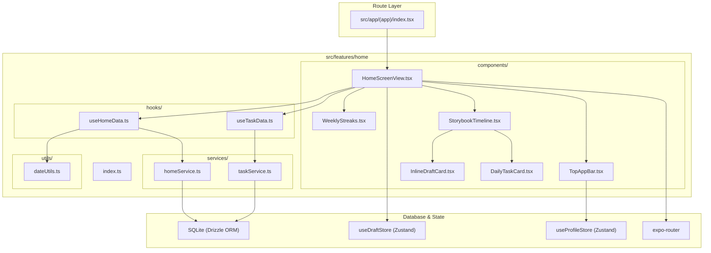

# Home Feature Architecture Overview

The **Home Feature** (`src/features/home`) manages the primary user timeline, daily tasks, weekly streaks, quick moment captures, and instant garden status summaries for the Nimo application.

---

## Directory Structure

```
src/features/home/
├── components/
│   ├── HomeScreenView.tsx       # Main visual timeline and dashboard screen view
│   ├── TopAppBar.tsx            # Header with greeting, weekly streak count & profile avatar
│   ├── WeeklyStreaks.tsx        # 7-day visual streak tracker row
│   ├── StorybookTimeline.tsx    # Chronological feed of daily reflections & prompt CTA
│   ├── InlineDraftCard.tsx      # Quick-capture composer card for audio/photos/notes
│   ├── DailyTaskCard.tsx        # Daily mindful task check-off card
│   ├── RecentEntries.tsx        # Compact view of recent journal entries
│   ├── MomentVideoPlayer.tsx    # High-performance inline video player for moments
│   ├── SyncIndicator.tsx        # Visual cloud sync indicator
│   └── tree/                    # Canvas-based procedural tree visualization
├── services/
│   ├── homeService.ts           # SQLite queries for moments, weekly streaks, garden summaries
│   ├── taskService.ts           # SQLite queries for daily mindful tasks
│   └── demoMomentsService.ts    # Demo data generator and cleanup for onboarding & testing
├── hooks/
│   ├── useHomeData.ts           # Coordinates timeline feed, streak computation, garden metrics
│   └── useTaskData.ts           # Coordinates daily task fetching, toggling, and completion
├── utils/
│   ├── dateUtils.ts             # Streak calculations, date formatting, and SQLite parsing
│   ├── gardenUtils.ts           # Color schemes, themes, and theme persistence
│   └── sentiment.ts             # Sentiment detection for emotion tags
├── docs/
│   ├── OVERVIEW.md              # Feature architecture & file interconnection (this file)
│   ├── COMPONENTS.md            # UI components, visual states, and prop contracts
│   ├── SERVICES.md              # Service API signatures, return types & side-effects
│   ├── HOOKS.md                 # Hook state transitions, triggers & actions
│   ├── UTILS.md                 # Constants, configuration, and date utilities
│   └── FLOWS.md                 # Interaction sequence diagrams and step-by-step flows
└── index.ts                     # Public API barrel export for external consumers
```

---

## How Files Link Together


