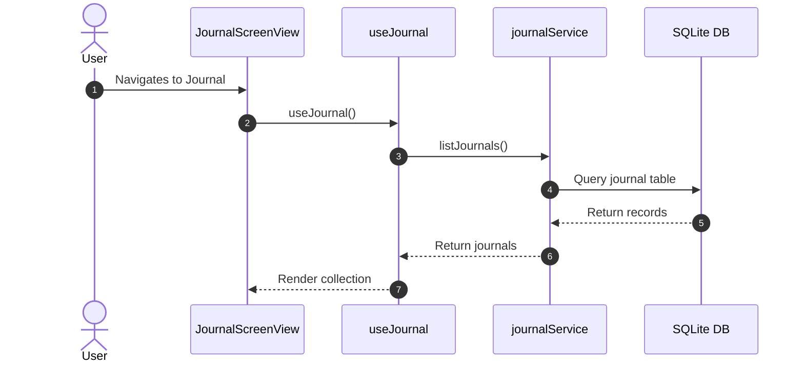

# Journal Feature Interaction Flows

Detailed interaction flows for journal notebook navigation.

---

## 1. List Journals Flow

```mermaid
sequenceDiagram
    autonumber
    actor User
    participant View as JournalScreenView
    participant Hook as useJournal
    participant Service as journalService
    participant DB as SQLite DB

    User->>View: Navigates to Journal
    View->>Hook: useJournal()
    Hook->>Service: listJournals()
    Service->>DB: Query journal table
    DB-->>Service: Return records
    Service-->>Hook: Return journals
    Hook-->>View: Render collection
```
