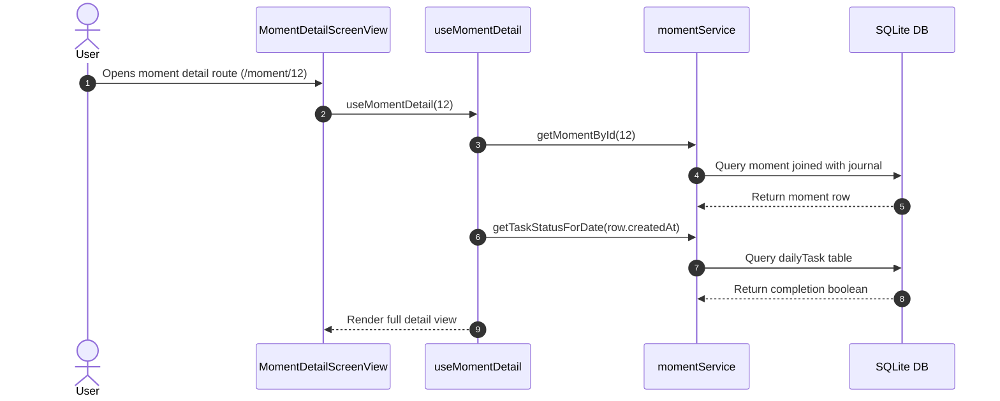

# Moment Feature Interaction Flows

Detailed interaction flows for loading moment details and task status.

---

## 1. Load Moment Flow

```mermaid
sequenceDiagram
    autonumber
    actor User
    participant View as MomentDetailScreenView
    participant Hook as useMomentDetail
    participant Svc as momentService
    participant DB as SQLite DB

    User->>View: Opens moment detail route (/moment/12)
    View->>Hook: useMomentDetail(12)
    Hook->>Svc: getMomentById(12)
    Svc->>DB: Query moment joined with journal
    DB-->>Svc: Return moment row
    Hook->>Svc: getTaskStatusForDate(row.createdAt)
    Svc->>DB: Query dailyTask table
    DB-->>Svc: Return completion boolean
    Hook-->>View: Render full detail view
```
