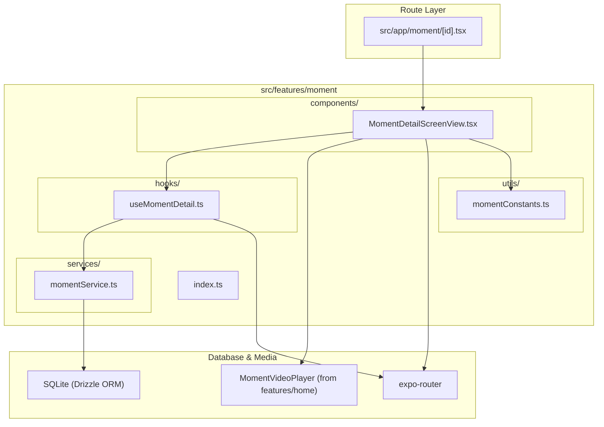

# Moment Feature Architecture Overview

The **Moment Feature** (`src/features/moment`) handles the full detail view for individual recorded reflections, displaying media attachments (1:1 square photos and inline videos), emotion indicators, and daily task completion badges.

---

## Directory Structure

```
src/features/moment/
├── components/
│   └── MomentDetailScreenView.tsx # Main scrollable detail view container
├── services/
│   └── momentService.ts           # SQLite queries for moment records and task status
├── hooks/
│   └── useMomentDetail.ts         # Coordinates route parameter parsing and record loading
├── utils/
│   └── momentConstants.ts         # Emotion configuration maps and data types
├── docs/
│   ├── OVERVIEW.md                # Feature architecture & file interconnection (this file)
│   ├── COMPONENTS.md              # UI components, visual states, and prop contracts
│   ├── SERVICES.md                # Service API signatures, return types & side-effects
│   ├── HOOKS.md                   # Hook state transitions, triggers & actions
│   ├── UTILS.md                   # Constants, configuration, and storage keys
│   └── FLOWS.md                   # Interaction sequence diagrams and step-by-step flows
└── index.ts                       # Public API barrel export for external consumers
```

---

## How Files Link Together


