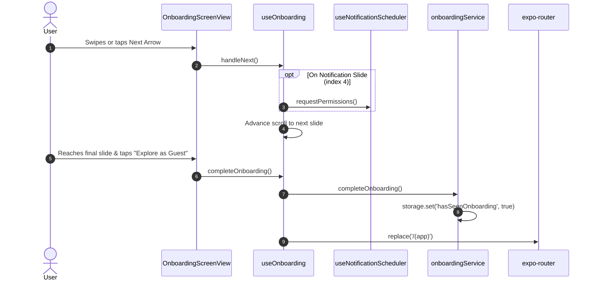

# Onboarding Feature Interaction Flows

Detailed interaction flows for walkthrough progression and authentication routing.

---

## 1. Walkthrough & Permissions Flow

```mermaid
sequenceDiagram
    autonumber
    actor User
    participant View as OnboardingScreenView
    participant Hook as useOnboarding
    participant Notif as useNotificationScheduler
    participant Svc as onboardingService
    participant Router as expo-router

    User->>View: Swipes or taps Next Arrow
    View->>Hook: handleNext()
    opt On Notification Slide (index 4)
        Hook->>Notif: requestPermissions()
    end
    Hook->>Hook: Advance scroll to next slide
    User->>View: Reaches final slide & taps "Explore as Guest"
    View->>Hook: completeOnboarding()
    Hook->>Svc: completeOnboarding()
    Svc->>Svc: storage.set('hasSeenOnboarding', true)
    Hook->>Router: replace('/(app)')
```
