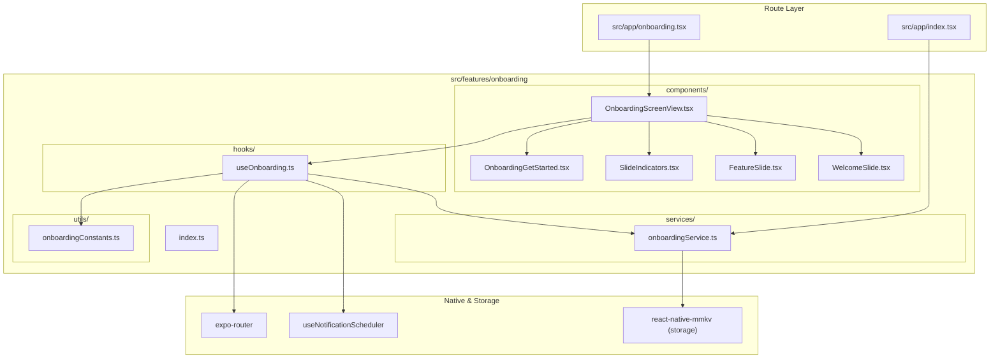

# Onboarding Feature Architecture Overview

The **Onboarding Feature** (`src/features/onboarding`) provides the welcoming walkthrough slides, brand introduction, notifications permission prompt, and initial identity entry points.

---

## Directory Structure

```
src/features/onboarding/
├── components/
│   ├── OnboardingScreenView.tsx # Main screen pager container with header & navigation footer
│   ├── WelcomeSlide.tsx         # Slide 0 hero presentation with mascot & typography
│   ├── FeatureSlide.tsx         # Slides 1-4 animated feature showcase slides
│   ├── SlideIndicators.tsx      # Animated spring pill dot indicators
│   └── OnboardingGetStarted.tsx # Slide 5 conversion slide with auth actions
├── services/
│   └── onboardingService.ts     # Persistence layer for onboarding completion state
├── hooks/
│   └── useOnboarding.ts         # Coordinates pager scroll, active indices & navigation actions
├── utils/
│   └── onboardingConstants.ts   # Dimensions, slide copy, media references & storage keys
├── docs/
│   ├── OVERVIEW.md              # Feature architecture & file interconnection (this file)
│   ├── COMPONENTS.md            # UI components, visual states, and prop contracts
│   ├── SERVICES.md              # Service API signatures, return types & side-effects
│   ├── HOOKS.md                 # Hook state transitions, triggers & actions
│   ├── UTILS.md                 # Constants, configuration, and storage keys
│   └── FLOWS.md                 # Interaction sequence diagrams and step-by-step flows
└── index.ts                     # Public API barrel export for external consumers
```

---

## How Files Link Together


