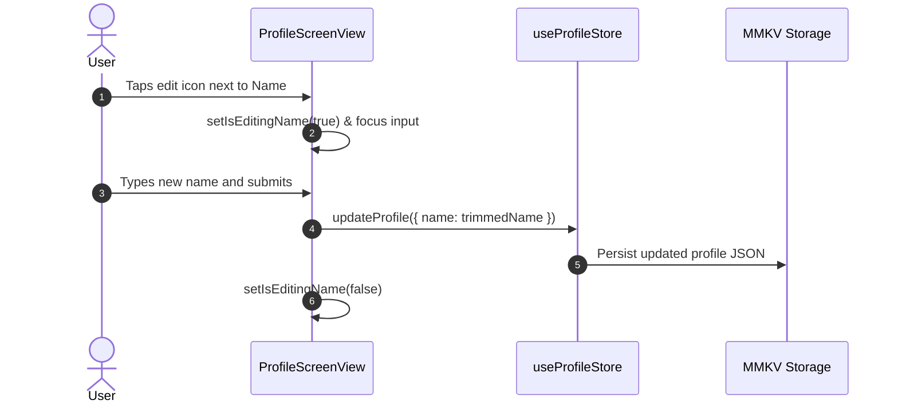
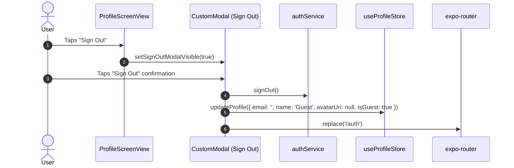

# Profile Feature Interaction Flows

Detailed interaction flows for profile updates and account sign-out.

---

## 1. Edit Name Flow

```mermaid
sequenceDiagram
    autonumber
    actor User
    participant View as ProfileScreenView
    participant Store as useProfileStore
    participant MMKV as MMKV Storage

    User->>View: Taps edit icon next to Name
    View->>View: setIsEditingName(true) & focus input
    User->>View: Types new name and submits
    View->>Store: updateProfile({ name: trimmedName })
    Store->>MMKV: Persist updated profile JSON
    View->>View: setIsEditingName(false)
```

---

## 2. Sign Out Flow

```mermaid
sequenceDiagram
    autonumber
    actor User
    participant View as ProfileScreenView
    participant Modal as CustomModal (Sign Out)
    participant AuthService as authService
    participant Store as useProfileStore
    participant Router as expo-router

    User->>View: Taps "Sign Out"
    View->>Modal: setSignOutModalVisible(true)
    User->>Modal: Taps "Sign Out" confirmation
    Modal->>AuthService: signOut()
    Modal->>Store: updateProfile({ email: '', name: 'Guest', avatarUri: null, isGuest: true })
    Modal->>Router: replace('/auth')
```
