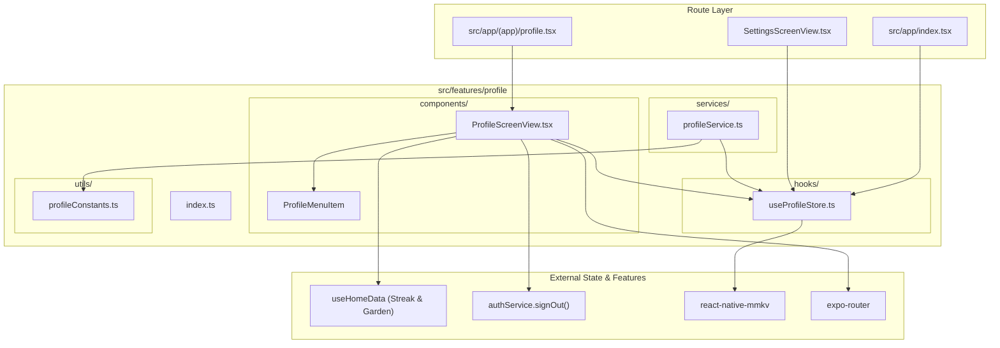

# Profile Feature Architecture Overview

The **Profile Feature** (`src/features/profile`) manages user identity, account settings, activity statistics (active streak, memory count, days active), and authentication hand-offs.

---

## Directory Structure

```
src/features/profile/
├── components/
│   └── ProfileScreenView.tsx    # Primary profile dashboard & account navigation screen
├── services/
│   └── profileService.ts        # Singleton service for profile retrieval and mutations
├── hooks/
│   └── useProfileStore.ts       # Zustand store with MMKV persistence for user profile
├── utils/
│   └── profileConstants.ts      # MMKV storage keys and default guest values
├── docs/
│   ├── OVERVIEW.md              # Feature architecture & file interconnection (this file)
│   ├── COMPONENTS.md            # UI components, visual states, and prop contracts
│   ├── SERVICES.md              # Service API signatures, return types & side-effects
│   ├── HOOKS.md                 # Hook state transitions, triggers & actions
│   ├── UTILS.md                 # Constants, configuration, and storage keys
│   └── FLOWS.md                 # Interaction sequence diagrams and step-by-step flows
└── index.ts                     # Public API barrel export for external consumers
```

---

## How Files Link Together


