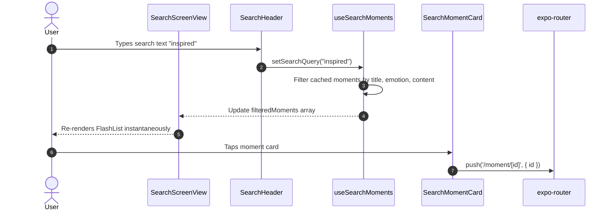

# Search Feature Interaction Flows

Detailed interaction flows for search filtering and detail view navigation.

---

## 1. Search Query Flow

```mermaid
sequenceDiagram
    autonumber
    actor User
    participant View as SearchScreenView
    participant Header as SearchHeader
    participant Hook as useSearchMoments
    participant Card as SearchMomentCard
    participant Router as expo-router

    User->>Header: Types search text "inspired"
    Header->>Hook: setSearchQuery("inspired")
    Hook->>Hook: Filter cached moments by title, emotion, content
    Hook-->>View: Update filteredMoments array
    View-->>User: Re-renders FlashList instantaneously
    User->>Card: Taps moment card
    Card->>Router: push('/moment/[id]', { id })
```
