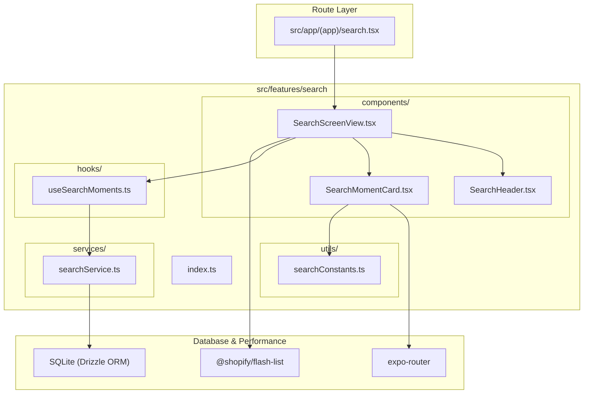

# Search Feature Architecture Overview

The **Search Feature** (`src/features/search`) provides instant client-side full-text and emotion keyword filtering across all user moments, displaying results in a 2-column masonry FlashList.

---

## Directory Structure

```
src/features/search/
├── components/
│   ├── SearchScreenView.tsx     # Primary masonry list container screen
│   ├── SearchHeader.tsx         # Search input text bar with clear and back controls
│   └── SearchMomentCard.tsx     # 1:1 aspect ratio card with emotion tag & task indicator
├── services/
│   └── searchService.ts         # SQLite query joining moments with daily tasks
├── hooks/
│   └── useSearchMoments.ts      # React Query data fetching and fuzzy filtering state
├── utils/
│   └── searchConstants.ts       # Emotion icons, color mappings, and item interfaces
├── docs/
│   ├── OVERVIEW.md              # Feature architecture & file interconnection (this file)
│   ├── COMPONENTS.md            # UI components, visual states, and prop contracts
│   ├── SERVICES.md              # Service API signatures, return types & side-effects
│   ├── HOOKS.md                 # Hook state transitions, triggers & actions
│   ├── UTILS.md                 # Constants, configuration, and storage keys
│   └── FLOWS.md                 # Interaction sequence diagrams and step-by-step flows
└── index.ts                     # Public API barrel export for external consumers
```

---

## How Files Link Together


