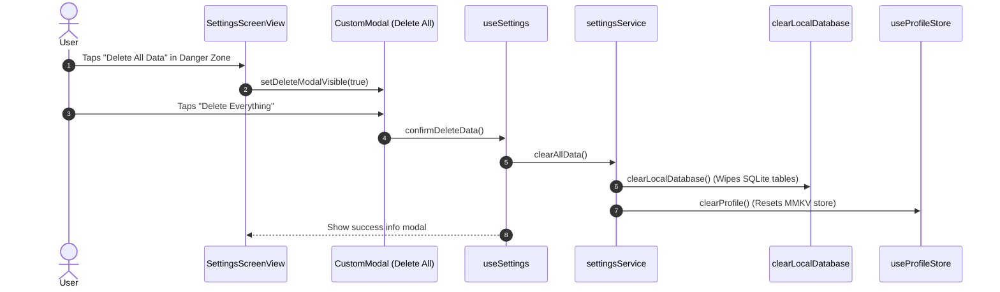

# Settings Feature Interaction Flows

Detailed interaction flows for data deletion and theme cycles.

---

## 1. Delete All Data Flow

```mermaid
sequenceDiagram
    autonumber
    actor User
    participant View as SettingsScreenView
    participant Modal as CustomModal (Delete All)
    participant Hook as useSettings
    participant Svc as settingsService
    participant Sync as clearLocalDatabase
    participant Store as useProfileStore

    User->>View: Taps "Delete All Data" in Danger Zone
    View->>Modal: setDeleteModalVisible(true)
    User->>Modal: Taps "Delete Everything"
    Modal->>Hook: confirmDeleteData()
    Hook->>Svc: clearAllData()
    Svc->>Sync: clearLocalDatabase() (Wipes SQLite tables)
    Svc->>Store: clearProfile() (Resets MMKV store)
    Hook-->>View: Show success info modal
```
