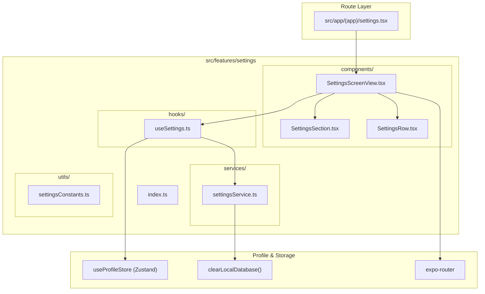

# Settings Feature Architecture Overview

The **Settings Feature** (`src/features/settings`) manages theme selection, daily reminders, legal agreements, feature request outreach, and permanent database clearing.

---

## Directory Structure

```
src/features/settings/
├── components/
│   ├── SettingsScreenView.tsx   # Top-level settings container screen
│   ├── SettingsSection.tsx      # Section wrapper with header label and rounded card
│   └── SettingsRow.tsx          # Reusable row with icon, label, chevron or custom accessory
├── services/
│   └── settingsService.ts       # Service methods for local database clearing
├── hooks/
│   └── useSettings.ts           # Coordinates modal visibility, themes, and sign-out
├── utils/
│   └── settingsConstants.ts     # Theme display maps and support mailto URLs
├── docs/
│   ├── OVERVIEW.md              # Feature architecture & file interconnection (this file)
│   ├── COMPONENTS.md            # UI components, visual states, and prop contracts
│   ├── SERVICES.md              # Service API signatures, return types & side-effects
│   ├── HOOKS.md                 # Hook state transitions, triggers & actions
│   ├── UTILS.md                 # Constants, configuration, and storage keys
│   └── FLOWS.md                 # Interaction sequence diagrams and step-by-step flows
└── index.ts                     # Public API barrel export for external consumers
```

---

## How Files Link Together


