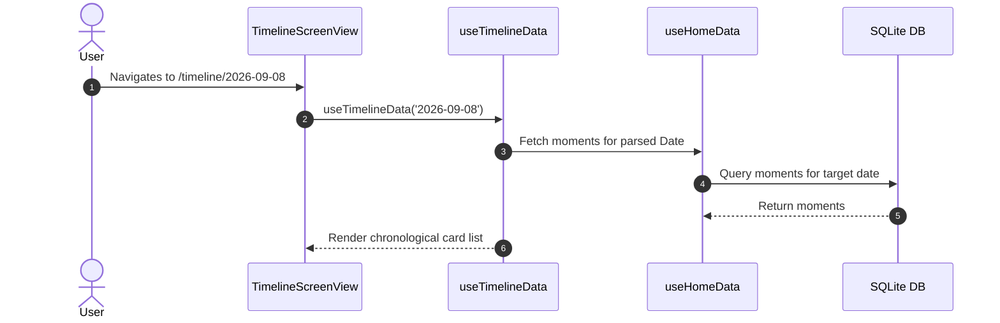

# Timeline Feature Interaction Flows

Detailed interaction flows for timeline navigation.

---

## 1. Load Timeline Flow

```mermaid
sequenceDiagram
    autonumber
    actor User
    participant View as TimelineScreenView
    participant Hook as useTimelineData
    participant HomeData as useHomeData
    participant DB as SQLite DB

    User->>View: Navigates to /timeline/2026-09-08
    View->>Hook: useTimelineData('2026-09-08')
    Hook->>HomeData: Fetch moments for parsed Date
    HomeData->>DB: Query moments for target date
    DB-->>HomeData: Return moments
    Hook-->>View: Render chronological card list
```
