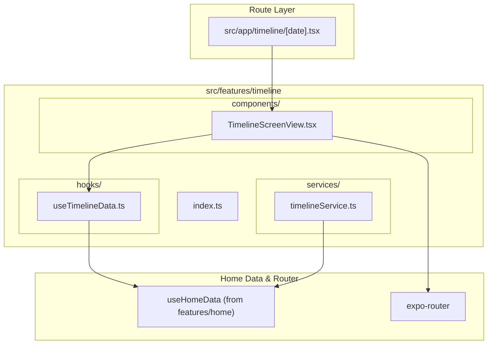

# Timeline Feature Architecture Overview

The **Timeline Feature** (`src/features/timeline`) displays the chronological record of daily entries for a specific day passed via dynamic route parameter (`/timeline/[date]`).

---

## Directory Structure

```
src/features/timeline/
├── components/
│   └── TimelineScreenView.tsx   # Chronological daily timeline screen view
├── services/
│   └── timelineService.ts       # Service methods for date-filtered moments
├── hooks/
│   └── useTimelineData.ts       # Hook parsing date routes and fetching daily reflections
├── utils/
│   └── timelineConstants.ts     # Timeline configuration and storage keys
├── docs/
│   ├── OVERVIEW.md              # Feature architecture & file interconnection (this file)
│   ├── COMPONENTS.md            # UI components, visual states, and prop contracts
│   ├── SERVICES.md              # Service API signatures, return types & side-effects
│   ├── HOOKS.md                 # Hook state transitions, triggers & actions
│   ├── UTILS.md                 # Constants, configuration, and storage keys
│   └── FLOWS.md                 # Interaction sequence diagrams and step-by-step flows
└── index.ts                     # Public API barrel export for external consumers
```

---

## How Files Link Together


